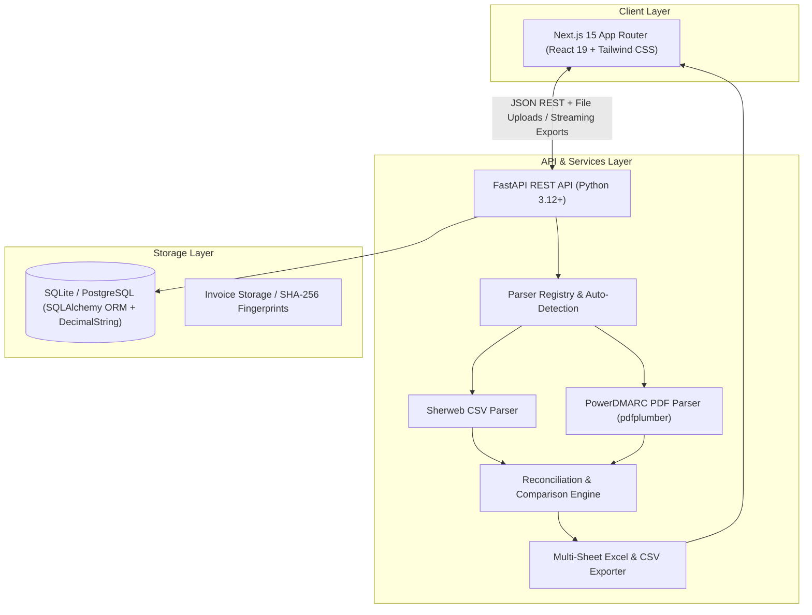
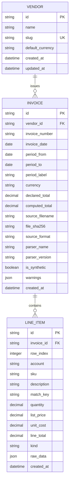
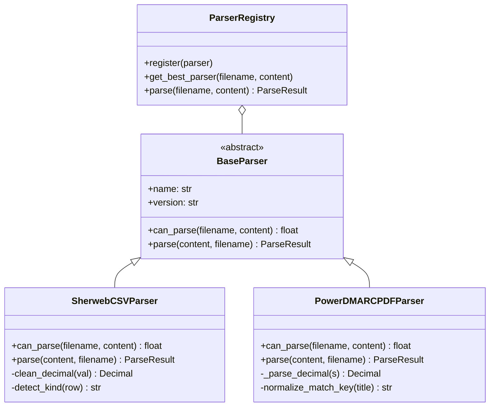
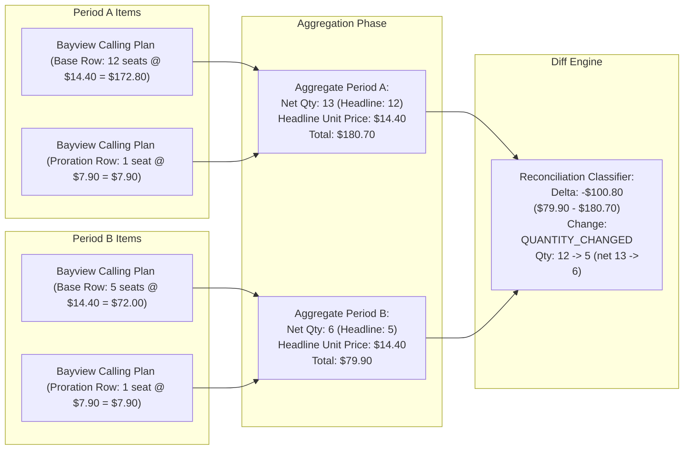

# Architecture & System Design

## 1. Executive Summary & Core Philosophy

The **Vendor Billing Reconciliation Engine** is a SaaS application engineered to solve multi-format vendor invoice drift, phantom charges, seat churn, and hidden rate increases.

### Core Architectural Principles
1. **Deterministic Decimal Arithmetic**: Zero floating-point arithmetic is permitted anywhere in the financial data lifecycle. Every monetary amount, unit cost, prorated rate, and quantity is stored, parsed, and computed using Python's `Decimal` class (`decimal.Decimal`) and custom database type decorators to prevent binary floating-point roundoff errors.
2. **Deterministic Mathematical Invariant**: Every period-over-period reconciliation adheres to the strict reconciliation invariant:
   $$\text{Computed Net Spend Delta} = \sum_{i \in \text{Changes}} \Delta\text{Amount}_i = \text{Total}_{\text{Target}} - \text{Total}_{\text{Base}}$$
   If this invariant does not balance to the exact cent, the system flags the reconciliation with discrepancy metrics.
3. **Multi-Format Ingestion Strategy**: A decoupled, extensible parser registry architecture auto-detects, validates, and parses CSV, PDF, and structured tabular formats without coupling downstream reconciliation logic to file-specific quirks.
4. **Transparent Line Item Provenance**: Every aggregated line item maintains pointers to its underlying raw input rows (`row_index`, `raw_data`, `line_total`), allowing operators to drill down from high-level KPI summaries to raw file payloads.

---

## 2. High-Level System Architecture



---

## 3. Data Model & Storage Design

The database schema models the vendor billing domain with normalized relationships while persisting high-precision monetary data as strings in the database and `Decimal` in application memory.



### In-Memory Decimal Aggregation & Custom `DecimalString` Storage
SQLite does not natively support an arbitrary-precision `NUMERIC` data type, and storing floats in database engines introduces irreversible binary floating-point precision loss. To guarantee precision regardless of the underlying database engine:
1. High-precision monetary and quantity values are persisted in the database as strings (`DecimalString` type decorator) and deserialized into Python `Decimal` objects in memory.
2. Because values are stored as string representations of arbitrary-precision decimals, mathematical aggregation and reconciliation arithmetic are executed deterministically in application Python code rather than relying on database engine SQL float aggregates (such as `SUM()` or `AVG()` which could cast to binary floats).

```python
class DecimalString(TypeDecorator):
    impl = String(40)
    cache_ok = True

    def process_bind_param(self, value, dialect):
        if value is None:
            return None
        return str(Decimal(str(value)))

    def process_result_value(self, value, dialect):
        if value is None:
            return None
        return Decimal(value)
```

---

## 4. Parser Architecture & Ingestion Pipeline

### Parser Strategy Pattern
All parser implementations inherit from `BaseParser`:



### Position-Based PDF Column Extraction
Rather than relying on regex leading-digit stripping on unstructured text streams, the PDF parser extracts tabular columns via coordinate bounding boxes (`col_desc_start`, `col_qty_start`, `col_rate_start`, `col_amount_start`). The row index (`#`) column resides strictly to the left of `col_desc_start` and is isolated from the line item description and match key, ensuring reordered rows or inserted items never pollute description strings.

### Ingestion Validation & Integrity Checks
During ingestion, the pipeline executes the following deterministic checks:
1. **SHA-256 Fingerprinting**: Computes the cryptographic checksum of the raw bytes to detect idempotent re-uploads and ensure data auditability.
2. **Tolerance Verification**: Sums the computed line totals ($\sum \text{Line Total}$) and validates against the declared invoice total within a strict tolerance ($\pm \$0.01$) to catch corrupted files or unparsed sub-tables.

### Row Classification Architecture & Kind Rules
To accurately reconcile complex billing datasets containing recurring charges, metered telemetry, mid-month prorations, and zero-dollar provisioning notices, the ingestion pipeline categorizes every invoice row into one of four deterministic `kind` classifications:

| Row Kind | Trigger Condition | Financial Treatment | Purpose & Example |
| :--- | :--- | :--- | :--- |
| `info` | Blank `Quantity` and blank `UnitPrice` | Quantity = 0, Total = LineTotal | Informational notes, provisioning notifications, or descriptive zero-cost notices. |
| `usage` | SKU starts with `SWAZPLU` (e.g., `SWAZPLU02`, `SWAZPLU03`) | Metered consumption | Variable cloud consumption (e.g., Azure plan usage) where rate/quantity fluctuate independently of contracted seats. |
| `credit` (or `partial`) | `Quantity < 0` or `LineTotal < 0` | Proration adjustment / Credit | Mid-period seat de-allocations, cancellation refunds, or promotional credit adjustments. |
| `charge` | Default (Positive `Quantity` and positive `LineTotal`) | Contracted seat commitment | Standard recurring full-period SaaS license subscriptions. |

#### Detailed Analysis: Credit / Partial Row Counting (39 vs 37)
In `samples/vendor-sherweb-2026-08.csv`, the ingestion preview and database breakdown report **39 credit/partial rows**, even though standard table filters identify **37 negative-quantity rows**:
1. **37 Negative-Quantity Rows**: Rows where `Quantity < 0` (e.g., $-1, -18, -6, -23$) with negative line totals ($-\$8.08, -\$34.28, -\$158.71$, etc.) reflecting mid-month license returns and prorated refunds.
2. **2 Negative-Dollar Credit Adjustment Rows**: Rows where `Quantity = 1` (positive quantity), but `UnitPrice` and `LineTotal` are negative:
   - Maple Court `COPILOTBUS1526Y1Y`: $\text{Qty} = 1, \text{Total} = -\$35.91$
   - Maple Court `PURVIEWBUSPRM5026Y1Y`: $\text{Qty} = 1, \text{Total} = -\$59.84$
   These represent annual commitment discount credits and partial-period promotional rebates.

Because both categories reduce the client's net payable balance, the engine normalizes all $37 + 2 = 39$ entries under the `credit` / `partial` classification while keeping recurring `charge` (188), metered `usage` (9), and structural `info` (9) rows cleanly segregated ($188 + 39 + 9 + 9 = 245$ rows).

---

## 5. Comparison & Reconciliation Engine

The period-over-period reconciliation algorithm solves the multi-row aggregation problem where single subscriptions are split across prorations, multiple billing cycles, or seat additions.



#### Composite Match Key Strategy
Items are grouped and matched period-over-period using a compound key:
- **For CSV / Structured Invoices**: `(Account Name, SKU)`
- **For PDF / SKU-less Invoices**: `(Account Name, Normalized Match Key)`

**PDF Match Key Normalization**:
PDF line items often include varying date tokens (e.g. `PowerDMARC MSP Partner Plan — Monthly 13 Aug 2026` vs `PowerDMARC MSP Partner Plan - Monthly 13 Sep 2026`). The `normalize_match_key` function strips:
1. Trailing date ranges (`\d{1,2}\s+(?:Jan|Feb|Mar|...)\s+\d{4}`)
2. Domain/tier notes (`40 domains included`, `50 domains included`)
3. Punctuation and excessive whitespace
This ensures `powerdmarc msp partner plan - monthly` matches cleanly across billing periods.

### Headline-Row Rule & Multi-Row Proration Rollup
In complex telecom and cloud distributor invoices (such as Sherweb), subscriptions often feature multiple line items in a single billing period:
1. A **recurring base subscription charge** covering full-term contracted seats (e.g., 12 seats in July, 5 seats in August at standard rate $14.40).
2. One or more **mid-month proration adjustments** covering newly added seats for a partial period (e.g., 1 seat for 17 days at $7.90).

**Why produce an aggregate comparison line instead of separate lines?**
If treated as independent rows, row-matching would attempt to match base charges against proration rows, creating false positive price hikes, bogus "removed" partial charges, or conflicting seat counts.

The comparison engine aggregates all rows sharing the same composite match key into a single conceptual subscription:
- **Headline Quantity ($12 \to 5$)**: The engine extracts the base recurring quantity as the primary headline figure. This reflects the real contracted seat commitment ($12$ seats reduced to $5$ seats = $-7$ seats).
- **Headline Unit Price ($\$14.40$)**: The recurring contract price per full month.
- **Financial Totals ($\$180.70 \to \$79.90$)**: Combines base charges ($12 \times \$14.40 = \$172.80$ in July, $5 \times \$14.40 = \$72.00$ in August) with proration charges ($1 \times \$7.90 = \$7.90$ in both periods).
- **Net Spend Delta ($-\$100.80$)**: Matches the base recurring reduction ($-7 \times \$14.40 = -\$100.80$) while accounting for all cents.
- **Interactive Drill-down**: The headline view displays the contracted subscription shift ($12 \to 5$), while expanding the row reveals the raw row breakdown and explains the net count after proration adjustments ($13 \to 6$).

### Change Classification Matrix

| Condition | Primary Classification | Line Count Impact | Notes Generated |
| :--- | :--- | :--- | :--- |
| Item exists only in Target period | `NEW` | **+1 Added** | Added item details, initial spend impact |
| Item exists only in Base period | `REMOVED` | **-1 Removed** | Deprecated item details, spend reduction |
| $\Delta \text{Price} \neq 0$ and $\Delta \text{Qty} = 0$ | `PRICE_CHANGED` | 0 (Stable) | Percentage unit price delta, rate shift |
| $\Delta \text{Qty} \neq 0$ and $\Delta \text{Price} = 0$ | `QUANTITY_CHANGED` | 0 (Stable) | License/seat expansion or reduction |
| $\Delta \text{Price} \neq 0$ and $\Delta \text{Qty} \neq 0$ | `PRICE_CHANGED` + `QUANTITY_CHANGED` | 0 (Stable) | Dual price hike and seat change |
| Meter/utility delta with stable contract | `USAGE_CHANGED` | 0 (Stable) | Metered consumption fluctuation |
| $\Delta \text{Price} = 0$ and $\Delta \text{Qty} = 0$ | `UNCHANGED` | 0 (Stable) | Invariant line items |

#### Why `USAGE_CHANGED` Does Not Count Toward Line Item Count Diffs
`USAGE_CHANGED` represents variable consumption fluctuations (such as metered API calls, bandwidth, or overage charges) on an existing, active vendor subscription.
Because the subscription exists in both the base and target periods, no contract addition or cancellation took place. Classifying usage deltas as line item count changes would mislead finance teams into believing vendor services were procured or terminated. Hence, `USAGE_CHANGED` reflects a spend and consumption variance while line item count delta remains zero.

---

## 6. Non-Obvious Decisions & Alternatives Rejected

### 1. Rejection of LLM-Based Parsing for Invoices
- **Alternative Considered**: Sending invoice text or PDF images to an LLM with a structured JSON schema.
- **Why Rejected**: LLMs are non-deterministic, have variable latency, suffer hallucination risks on large 300+ line tables, and incur recurring per-token costs. Coordinate-based extraction with `pdfplumber` and typed CSV parsing provide 100% mathematical reproducibility.

### 2. Rejection of Naive 1-to-1 Row Diffing
- **Alternative Considered**: Comparing line item row $N$ of Invoice A directly to row $N$ of Invoice B.
- **Why Rejected**: Invoice vendors frequently reorder rows, insert newly purchased items alphabetically or chronologically, or split single subscriptions into multiple prorated entries. Row-by-row diffing results in massive false-positive churn. Grouping by `(account, sku)` aggregates multiple prorations and isolates contract modifications.

### 3. Rejection of Float Data Types for Financials
- **Alternative Considered**: Standard IEEE-754 Python `float` and SQL `FLOAT` / `REAL`.
- **Why Rejected**: Binary representation cannot precisely represent decimal fractions like `$0.10$`. In a 250-row reconciliation, accumulated rounding drift causes balance sheet mismatches and ruins client trust.

### 4. Excel Export Styling with Native OpenPyXL
- **Alternative Considered**: Plain CSV downloads or client-side HTML table exports.
- **Why Rejected**: Financial operators require pre-formatted Excel workbooks (`.xlsx`) with multiple sheets (Summary KPI Sheet + Itemized Changes Sheet), formatted currency numbers (`$#,##0.00`), color-coded delta indicators (green/red), auto-fit column widths, and frozen header rows.

### 5. Dedicated `is_synthetic` Flag for Test Fixtures
- **Alternative Considered**: Treating synthetic test fixtures identically to production invoices or hardcoding dummy data.
- **Why Rejected**: Production users must not have their dashboard KPIs contaminated by test fixtures. By introducing `is_synthetic: bool` on the `Invoice` model, synthetic fixtures are clearly badged ("Test fixture" chip) and excluded from real spend rollups while still remaining fully diffable for automated QA.

### 6. Dual Headline vs Net Quantity Representation for Prorations
- **Alternative Considered**: Displaying only net aggregated quantity or only headline recurring seat count.
- **Why Rejected**: Showing only net quantity (`13 → 6`) for Bayview Clinic confuses users looking at standard monthly license counts (`12 → 5`), while showing only headline quantity hides the financial math behind the 1-seat partial-period charge (`+$7.90`). The engine computes both: displaying headline subscription count (`12 → 5`) at the top level while surfacing the net proration derivation (`Net quantity after proration adjustments: 13 -> 6`) in the interactive drill-down.

---

## 7. Performance & Scalability Considerations

- **Memory Usage (Estimated)**: Application memory consumption during parsing and reconciliation is bounded to $\mathcal{O}(M)$ where $M$ is the row count of a single invoice (estimated at $< 2\text{ MB}$ RAM footprint for typical invoices under $10,000$ line items).
- **Database Indexes**: To guarantee fast query lookups and enforce integrity, the schema utilizes the following indexes:
  - `vendors`: `slug` (unique index), `name` (unique index), `id` (primary key).
  - `invoices`: `(vendor_id, period_label)` (composite unique constraint / index `uq_vendor_period`), `vendor_id` (foreign key index), `file_sha256` (lookup index), `id` (primary key).
  - `line_items`: `invoice_id` (foreign key index), `account` (index), `sku` (index), `match_key` (index), `kind` (index), `id` (primary key).
